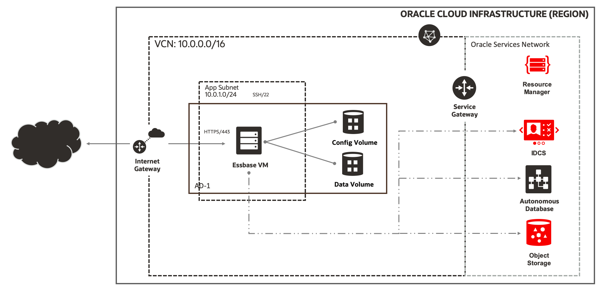

<p float="left">
   
  <br/>
  <h1>Oracle Essbase on Oracle Cloud Infrastructure</h1>
  <br/>
</p>


[Oracle Essbase][essbase] is a business analytics solution that uses a proven, flexible, best-in-class architecture for analysis, reporting, and collaboration. It delivers instant value and greater productivity for your business users, analysts, modelers, and decision-makers, across all lines of business within your organization. You can interact with Essbase, through a web or Microsoft Office interface, to analyze, model, collaborate, and report.

This Quick Start automates the deployment of Oracle Essbase on [Oracle Cloud Infrastructure (OCI)][oci]. It can also deploy additional stack components required – Autonomous Database, Load Balancer, Storage, Virtual Cloud Network (VCN) as part of the deployment.

### Default Topology



The above digram shows the default topology supported by the terraform scripts.  In the basic topology, the Essbase compute instance is exposed on a public subnet, and configured using the target autonomous database for the RCU schema.

### Full Topology


The above digram shows the full topology supported by the terraform scripts.  In this scenario, the application subnet is private. To access the Essbase user interface, an OCI load balancer is provisioned in another public regional subnet.  A bastion host is also provisioned to support connectivity from the Resource Manager.

## Before you get started

### Encrypt Values using KMS

Oracle Cloud Infrastructure Key Management (KMS) enables you to manage sensitive information when creating a stack. You are required to use KMS to encrypt credentials during provisioning by creating a key. Passwords chosen for Essbase administrator and Database must meet their respective password requirements.

### Create Dynamic Group

You create dynamic groups of Oracle Cloud Infrastructure compute instances, and associate them with policies. For more information on dynamic groups, see [Managing Dynamic Groups](https://docs.cloud.oracle.com/iaas/Content/Identity/Tasks/managingdynamicgroups.htm).

### Setup Policies

Set up policies that are appropriate for your organization's security setup. The following is an example of a policy template, with each row being a policy statement.

```
allow group group_name to manage virtual-network-family in compartment compartment_name
allow group group_name to manage load-balancers in compartment compartment_name
allow group group_name to manage app-catalog-listing in compartment compartment_name
allow group group_name to manage instances in compartment compartment_name
allow group group_name to manage volume-family in compartment compartment_name
allow group group_name to use instance-family in compartment compartment_name
allow group group_name to manage autonomous-database-family in compartment compartment_name
allow group group_name to manage autonomous-backups in compartment compartment_name
allow group group_name to manage buckets in compartment compartment_name
allow group group_name to manage objects in compartment compartment_name
allow group group_name to use vaults in compartment compartment_name
allow group group_name to use keys in compartment compartment_name
```

Some policies may be optional, depending on expected use. For example, if you're not using a load balancer, you don't need a policy that allows management of load balancers.

To allow instances within the compartment to invoke functionality without requiring further authentication, you must have group policies for the instances in the compartment. To do this, create a dynamic group, and set the policies for that dynamic group, such as shown in the following example:

```
allow dynamic-group group_name to inspect volume-groups in compartment compartment_name
allow dynamic-group group_name to manage volumes in compartment compartment_name
allow dynamic-group group_name to manage volume-group-backups in compartment compartment_name
allow dynamic-group group_name to manage volume-backups in compartment compartment_name
allow dynamic-group group_name to use autonomous-database in compartment compartment_name
allow dynamic-group group_name to manage autonomous-backups in compartment compartment_name
allow dynamic-group group_name to read buckets in compartment compartment_name
allow dynamic-group group_name to manage objects in compartment compartment_name
```

## Getting started using the Terraform command line tool


You'll want a local copy of this repo. You can make that with the commands:

```
git clone https://github.com/oracle-quickstart/oci-essbase.git
cd oci-essbase/terraform
```

We now need to initialize the directory with the module in it. This makes the module aware of the OCI provider. You can do this by running:

```
terraform init
```

### Configure

Choose the Essbase image that corresponds to the desired [license](#License), by removing the .disabled extension on either the [essbase-byol.auto.tfvars.disabled](./terraform/essbase-byol.auto.tfvars.disabled) or [essbase-ucm.auto.tfvars.disabled](./terraform/essbase-ucm.auto.tfvars.disabled) file.  Set the remaining variables needed to drive the stack creation.  This can be done by creating the terraform.tfvars from the [template file](./terraform/terraform.tfvars.template), or using environment variables as described here.

Let's make sure the plan looks good:

```
terraform plan
```

### Deploy

If that's good, we can go ahead and apply the deploy:

```
terraform apply
```

You'll need to enter yes when prompted. The apply should take about twenty minutes to run.

When the apply is complete, the infrastructure will be deployed and the Essbase product will be running.

### Destroy the Deployment

When you no longer need the deployment, you can run this command to destroy it:

```
terraform destroy
```

You'll need to enter yes when prompted.

## Getting Started Using Resource Manager

[Resource Manager][orm] is an Oracle Cloud Infrastructure service that allows you to manage your terraform configuration and state. 
To simplify getting started, the terraform BYOL and UCM stacks for use with the Resource Manager service are created as part of each [release](https://github.com/oracle-quickstart/oci-essbase/releases).

```
Allow group group_name to manage orm-stacks in compartment compartment_name
Allow group group_name to manage orm-jobs in compartment compartment_name
```

## License

This template assumes you already have purchased a license for Oracle Essbase. For more information, see XXX.


## Questions

If you have an issue or a question, please take a look at our [FAQs](./FAQs.md) or [open an issue](https://github.com/oracle-quickstart/oci-essbase/issues/new).

[essbase]: https://docs.oracle.com/en/database/other-databases/essbase/19.3/index.html
[oci]: https://cloud.oracle.com/en_US/cloud-infrastructure
[orm]: https://docs.cloud.oracle.com/iaas/Content/ResourceManager/Concepts/resourcemanager.htm
[tf]: https://www.terraform.io
