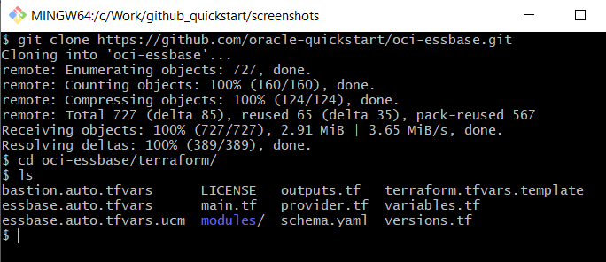
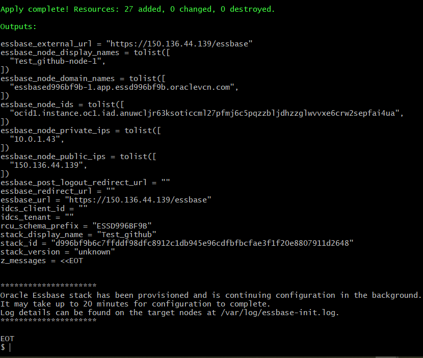
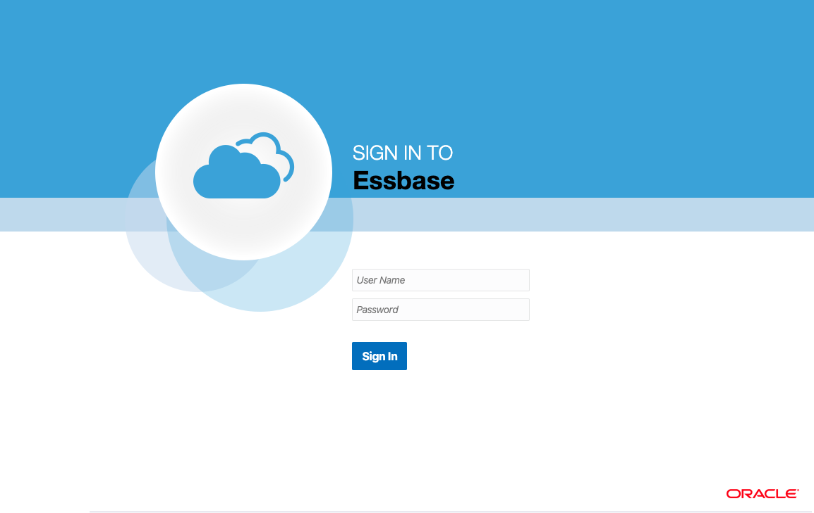
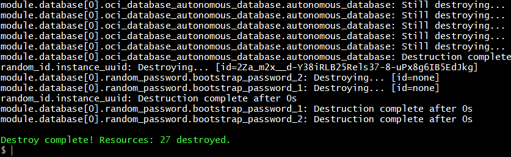

<p float="left">
   
  <br/>
  <h1>Oracle Essbase on Oracle Cloud Infrastructure</h1>
  <br/>
</p>


[
](https://console.us-phoenix-1.oraclecloud.com/resourcemanager/stacks/create?region=home&zipUrl=https://github.com/oracle-quickstart/oci-essbase/releases/download/v21.7.2.0.1/essbase-stack-v21.7.2.0.1-byol.zip)

[Oracle Essbase][essbase] is a business analytics solution that uses a proven, flexible, best-in-class architecture for analysis, reporting, and collaboration. It delivers instant value and greater productivity for your business users, analysts, modelers, and decision-makers, across all lines of business within your organization. You can interact with Essbase, through a web or Microsoft Office interface, to analyze, model, collaborate, and report.

This Quick Start automates the deployment of Oracle Essbase on [Oracle Cloud Infrastructure (OCI)][oci]. It can also deploy additional stack components required – Autonomous Database, Load Balancer, Storage, Virtual Cloud Network (VCN) as part of the deployment.

For more details on deploying the Essbase stack on Oracle Cloud Infrastructure, please visit the [Administering Oracle Essbase](https://docs.oracle.com/en/database/other-databases/essbase/21/essad/index.html) guide.

### Default Topology


The above digram shows the default topology supported by the terraform scripts.  In the basic topology, the Essbase compute instance is exposed on a public subnet, and configured using the target autonomous database for the RCU schema.

### Full Topology


The above diagram shows the full topology supported by the terraform scripts.  In this scenario, the application subnet is private. To access the Essbase user interface, an OCI load balancer is provisioned in either public or private regional subnet.  An OCI Bastion Service instance can be used from OCI to allow access through a public ip address.

## Before You Begin with Oracle Essbase

Refer to the [documentation](https://docs.oracle.com/en/database/other-databases/essbase/21/essad/you-begin-oracle-essbase.html) for the pre-requisite steps to using Essbase on OCI.

### Create Secrets with OCI Vault

Oracle Cloud Infrastructure [Vault][vault] enables you to manage sensitive information when creating a stack. You are required to store your credentials in the vault prior to provisioning the Essbase stack. Passwords chosen for Essbase administrator and Database must meet their respective password requirements.

### Create Dynamic Group

You create dynamic groups of Oracle Cloud Infrastructure compute instances, and associate them with policies. For more information on dynamic groups, see [Managing Dynamic Groups](https://docs.cloud.oracle.com/iaas/Content/Identity/Tasks/managingdynamicgroups.htm).

### Setup Policies

Set up policies that are appropriate for your organization's security setup. The following is an example of a policy template, with each row being a policy statement.
Please refer to the 21c Oracle documentation for the up-to-date list.

```
allow group group_name to manage virtual-network-family in compartment compartment_name
allow group group_name to manage load-balancers in compartment compartment_name
allow group group_name to manage app-catalog-listing in compartment compartment_name
allow group group_name to manage instances in compartment compartment_name
allow group group_name to manage volume-family in compartment compartment_name
allow group group_name to use instance-family in compartment compartment_name
allow group group_name to manage autonomous-database-family in compartment compartment_name
allow group group_name to manage autonomous-backups in compartment compartment_name
allow group group_name to manage buckets in compartment compartment_name
allow group group_name to manage objects in compartment compartment_name
allow group group_name to use vaults in compartment compartment_name
allow group group_name to use keys in compartment compartment_name
allow group group_name to use secrets in compartment compartment_name
```

Some policies may be optional, depending on expected use. For example, if you're not using a load balancer, you don't need a policy that allows management of load balancers.

To allow instances within the compartment to invoke functionality without requiring further authentication, you must have group policies for the instances in the compartment. To do this, create a dynamic group, and set the policies for that dynamic group, such as shown in the following example:

```
allow dynamic-group group_name to inspect volume-groups in compartment compartment_name
allow dynamic-group group_name to manage volumes in compartment compartment_name
allow dynamic-group group_name to manage volume-group-backups in compartment compartment_name
allow dynamic-group group_name to manage volume-backups in compartment compartment_name
allow dynamic-group group_name to use autonomous-database in compartment compartment_name
allow dynamic-group group_name to manage autonomous-backups in compartment compartment_name
allow dynamic-group group_name to read buckets in compartment compartment_name
allow dynamic-group group_name to manage objects in compartment compartment_name
allow dynamic-group group_name to use keys in compartment compartment_name
allow dynamic-group group_name to use secrets in compartment compartment_name
```

## Using the Terraform command line tool

You'll want a local copy of this repo. You can make that with the commands:

```
git clone https://github.com/oracle-quickstart/oci-essbase.git
cd oci-essbase/terraform
ls
```



We now need to initialize the directory with the module in it. This makes the module aware of the OCI provider. You can do this by running:

```
terraform init
```


### Configure

By default, the Essbase image selected is the BYOL [license](#License). To use the UCM [license](#License), replace the `essbase.auto.tfvars` file with `essbase.auto.tfvars.ucm`. Set the remaining [variables](./VARIABLES.md) needed to drive the stack creation.  This can be done by creating the terraform.tfvars from the [template file](./terraform/terraform.tfvars.template), or using environment variables as described here.

Let's make sure the plan looks good:

```
terraform plan
```


### Deploy

If that's good, we can go ahead and apply the deploy:

```
terraform apply
```

You'll need to enter yes when prompted. The apply can take up to twenty minutes to run.



When the apply is complete, the infrastructure will be deployed and the Essbase product will be running, and can be accessed at the given `essbase_url` output variable.



### Destroy the Deployment

When you no longer need the deployment, you can run this command to destroy it:

```
terraform destroy
```

You'll need to enter yes when prompted.



## Using OCI Resource Manager

Oracle Cloud Infrastructure [Resource Manager (ORM)][orm] allows you to manage your terraform configurations and state.
To simplify getting started, the terraform stacks for use with ORM are created as part of each [release](https://github.com/oracle-quickstart/oci-essbase/releases).

Note, you may need to update your policies for accessing the ORM service.

```
allow group group_name to manage orm-stacks in compartment compartment_name
allow group group_name to manage orm-jobs in compartment compartment_name
```

## Post-Deployment Tasks

Refer to the [documentation](https://docs.oracle.com/en/database/other-databases/essbase/21/essad/complete-deployment-tasks.html) for a list of post-deployment tasks.

## License

These terraform scripts are licensed under the Universal Permissive License 1.0.  See [LICENSE](./LICENSE) for more details.

There are two licensing options available:

### Universal Credits Model (UCM)
The listing in OCI Marketplace can be found here: https://cloudmarketplace.oracle.com/marketplace/en_US/listing/67812026
When deploying using UCM, the Essbase license in governed by the following Licensing terms: https://cloudmarketplace.oracle.com/marketplace/content?contentId=70514770&render=inline

### Bring Your Own License (BYOL)
The listing in OCI Marketplace can be found here: https://cloudmarketplace.oracle.com/marketplace/en_US/listing/63497640
When deploying using BYOL, the Essbase license is governed by the following Licensing terms: https://cloudmarketplace.oracle.com/marketplace/content?contentId=18088784&render=inline

The Oracle Essbase product requires an on-premises purchased license and active support contract. This allows customers to leverage BYOL option for deploying Essbase on OCI.

## Questions

If you have an issue or a question, please take a look at our [FAQs](./FAQs.md) or [open an issue](https://github.com/oracle-quickstart/oci-essbase/issues/new).

[essbase]: https://docs.oracle.com/en/database/other-databases/essbase/21/index.html
[oci]: https://cloud.oracle.com/cloud-infrastructure
[orm]: https://docs.cloud.oracle.com/iaas/Content/ResourceManager/Concepts/resourcemanager.htm
[vault]: https://docs.cloud.oracle.com/iaas/Content/KeyManagement/Concepts/keyoverview.htm
[tf]: https://www.terraform.io
